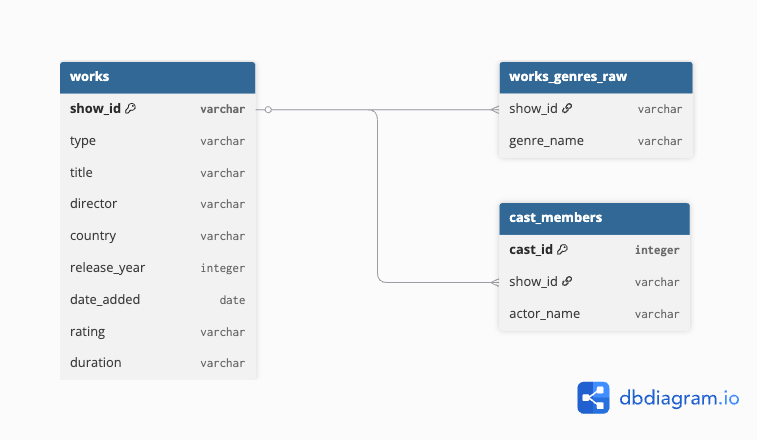

# Netflix Content Data Analysis Project

## Project Description
This project uses Kaggle's Netflix public dataset (8,800 contents) 
to verify with data that Korea has a higher proportion of 
TV Show genres than other countries and derive insights.

## Used Technics
- Python (pandas) — Refining and Processing Data
- SQLite — DB Design and Structuring
- SQL — Data Analysis Queries
- Excel — Organizing and visualizing results

## Project Structure
```
netflix_project/
├── netflix_titles.csv       # Raw Data from Kaggle
├── 01_data_cleaning.py      # Refining Data and Storing in DB
├── 03_sql_analysis.sql      # Analysis Queries
├── 04_excel_export.py       # Exporting to Excel
├── netflix.db               # SQLite DB
├── netflix_analysis.xlsx    # Analysis Result
└── ERD.png                  # Table Relationship Chart
```

## Data Structure (ERD)


| Table | Description |
|--------|------|
| works | Basic Information of Contents |
| works_genres_raw | Content-Genre Connection Table |
| cast_members | Cast Information |

## Analysis Procedure

### 1. Data Refining
- Load source CSV 8,800 lines
- Dealing with missing values (country, director, cast)
- Date_add date format conversion
- Separating the list_in genre column

### 2. DB Structuring
- Spliting 1 original CSV into 3 normalized tables
- Design a genre, cast multi-value column as a separate table
- Load to SQLite DB

### 3. SQL Analysis
- Create a total of 9 queries
- Understand the overall status (Query 1-6)
- Intensive analysis of Korean content (Query 7-9)

## Main Insights
- Korea's TV Show Ratio is 79.4 percent, which is top 1 of major countries.
- Top three genres in Korean content are
    1. International TV Shows 
    2. Korean TV Shows 
    3. Romantic TV Shows
- South Korea's TV Show peaked at 44 in 2019, increased 37.5% from 2017,
  visualizes the beginning of Netflix's investment in Korean content

## Data Source
- [Kaggle — Netflix Movies and TV Shows](https://www.kaggle.com/datasets/shivamb/netflix-shows)

